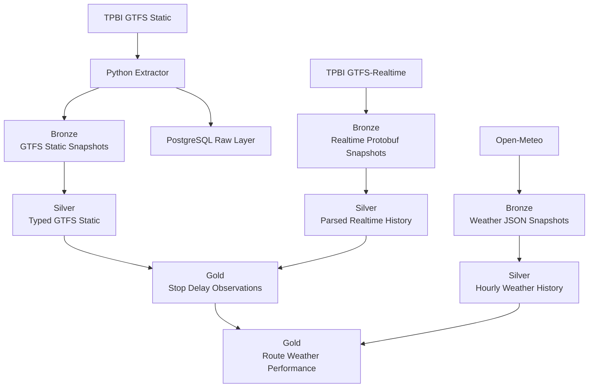
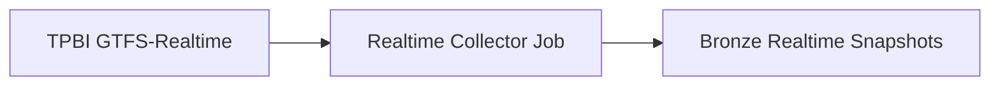
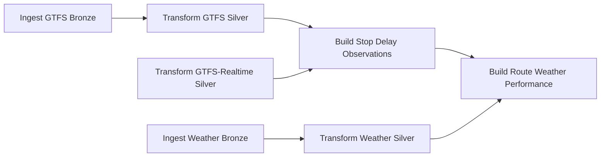

# Bucharest Urban Mobility Data Platform

An end-to-end data engineering project that integrates Bucharest public transport data with weather data to build historical datasets for analyzing transport performance under different weather conditions.

The project combines a relational ingestion pipeline built with **Python and PostgreSQL** with a **Databricks lakehouse architecture using PySpark and Delta Lake**. It processes GTFS Static data, continuously changing GTFS-Realtime feeds, and hourly weather observations into analytical datasets.

The main analytical question is:

> **How do weather conditions affect public transport performance in Bucharest?**

---

## Architecture

The project contains two complementary data engineering implementations.

The first uses PostgreSQL to demonstrate transactional relational ingestion, snapshot tracking, referential integrity, and idempotency for structured GTFS Static data.

The second extends the project into a Databricks lakehouse designed to preserve historical static, realtime, and weather data using a Bronze / Silver / Gold architecture.



This architecture keeps the original PostgreSQL implementation as a separate relational ingestion path rather than using PostgreSQL as an unnecessary intermediate step before Databricks.

---

## Data Sources

### GTFS Static: TPBI

Static public transport schedule and network data for the Bucharest region.

The pipeline processes seven core GTFS entities:

- `agency`
- `stops`
- `routes`
- `calendar`
- `trips`
- `stop_times`
- `shapes`

A single GTFS snapshot contains roughly **1.6 million rows**, with `stop_times` representing the largest dataset.

### GTFS-Realtime: TPBI

Three GTFS-Realtime protobuf feeds are collected:

- Trip Updates
- Vehicle Positions
- Service Alerts

Raw protobuf responses are preserved before parsing so that the original source payload remains available.

### Weather: Open-Meteo

Hourly weather data is collected for a representative point in Bucharest.

Variables include:

- temperature
- precipitation
- rain
- snowfall
- weather code
- wind speed

---

## Technology Stack

| Area | Technologies |
|---|---|
| Language | Python |
| Relational Storage | PostgreSQL 17 |
| Local Infrastructure | Docker Compose |
| Data Processing | Apache Spark / PySpark |
| Lakehouse Platform | Databricks |
| Lakehouse Storage | Delta Lake |
| Catalog | Unity Catalog |
| Orchestration | Databricks Jobs |
| Data Formats | CSV, Protocol Buffers, JSON, Delta |
| External APIs | TPBI, Open-Meteo |
| Python Tooling | uv, Ruff |
| Version Control | Git, GitHub |

---

## Relational GTFS Ingestion

The first implementation of the project focuses on building a reliable relational ingestion pipeline for GTFS Static data.

```text
TPBI GTFS Static
        ↓
Python Extractor
        ↓
Local GTFS Files
        ↓
Python Loader
        ↓
PostgreSQL Raw Schema
```

Each ingestion creates a batch representing one complete GTFS snapshot.

A SHA-256 hash of the downloaded snapshot is stored in `raw.ingestion_batches`. Before loading a new snapshot, the pipeline checks whether the same hash has already been processed.

This provides **idempotent ingestion**: running the loader multiple times with the same source snapshot does not create duplicate data.

All GTFS entities belonging to a snapshot share the same `batch_id`.

The loader also uses a single database transaction for the complete batch and PostgreSQL `COPY` for efficient bulk loading.

The relational model includes composite primary and foreign keys to preserve relationships between GTFS entities within the same snapshot.

---

## Databricks Lakehouse

The lakehouse implementation uses a **Bronze / Silver / Gold** architecture.

### Bronze Layer

Bronze preserves source-oriented historical data with ingestion metadata.

#### GTFS Static

The snapshot identifier is generated from the contents and filenames of the extracted GTFS files.

Each static table preserves multiple source snapshots instead of representing only the latest state.

#### GTFS-Realtime

Realtime feeds are stored in a unified Delta table:

`bronze.gtfs_realtime_snapshots`

Each row represents one raw feed response and contains metadata such as:

- feed type
- source feed timestamp
- ingestion timestamp
- payload hash
- raw protobuf payload
- entity count
- payload size

Payload hashes prevent identical responses from being stored repeatedly.

The raw protobuf payload is retained so parsing logic can be changed later without recollecting the original realtime data.

#### Weather

Raw Open-Meteo API responses are stored as JSON snapshots with hash-based deduplication.

---

## Silver Layer

Silver converts raw source data into typed, structured historical datasets.

### GTFS Static

Static GTFS fields are converted into appropriate analytical types while preserving snapshot history.

GTFS schedule times require special handling because valid GTFS times can exceed `24:00:00`.

For this reason, the pipeline preserves the original time strings and additionally calculates service-day seconds such as `arrival_seconds` and `departure_seconds`.

### GTFS-Realtime

Raw protobuf snapshots are parsed into five historical Delta tables:

- `trip_updates`
- `stop_time_updates`
- `vehicle_positions`
- `service_alerts`
- `alert_informed_entities`

Successive realtime predictions are preserved rather than replacing earlier observations.

### Weather

Weather JSON snapshots are normalized into hourly observations.

Multiple source snapshots for the same weather hour are intentionally retained in Silver, preserving the history of data received from the API.

---

## Gold Layer

Gold contains datasets designed for analytical consumption.

### `gold.stop_delay_observations`

**Grain:** one realtime snapshot × trip × stop prediction.

This dataset combines GTFS-Realtime predictions with the appropriate GTFS Static schedule snapshot.

It calculates **predicted schedule deviation**, not actual observed arrival delay.

The pipeline explicitly handles the timezone difference between:

- GTFS Static schedules: `Europe/Bucharest`
- GTFS-Realtime Unix timestamps: UTC

Successive predictions for the same trip and stop are preserved, allowing changes in predicted schedule deviation to be analyzed over time.

### `gold.route_weather_performance`

**Grain:** one route × observation hour.

The mart aggregates stop-level predictions into route-hour performance metrics and enriches them with hourly weather conditions.

Metrics include:

- number of predictions
- distinct trips
- average predicted delay
- median predicted delay
- 90th percentile predicted delay
- percentage of predictions delayed by more than five minutes

Because Silver preserves multiple weather snapshots for the same hour, the Gold transformation explicitly selects the latest available weather version for each weather timestamp before joining.

---

## Databricks Orchestration

Data acquisition and downstream processing are intentionally separated.

### Realtime Collector

The realtime collector is an independent bounded Databricks Job.



The collector polls the GTFS-Realtime feeds during a bounded collection session and stores changed protobuf responses in Bronze.

This allows realtime history to be collected on demand without requiring permanent 24/7 infrastructure.

### Processing Pipeline

The main Databricks Job orchestrates seven tasks with explicit dependencies:



The branches can execute independently where dependencies allow it.

The Gold stop-delay dataset requires both static schedules and parsed realtime predictions, while the final route-weather mart requires both stop-level performance observations and normalized weather data.

---

## Data Quality and Reliability

The project includes several mechanisms to protect data quality and prevent duplicate processing:

- SHA-256 snapshot identification
- idempotent PostgreSQL batch ingestion
- hash-based realtime payload deduplication
- hash-based weather snapshot deduplication
- Delta Lake schema enforcement
- explicit dataset grain validation
- primary and foreign key validation in PostgreSQL
- historical snapshot preservation
- temporal selection of the correct GTFS Static snapshot
- explicit timezone conversion
- weather snapshot version resolution before Gold aggregation

The realtime-to-static matching process does not assume every realtime record can be mapped perfectly to the static schedule. Unmatched records are excluded from schedule-deviation calculations rather than generating unreliable delay metrics.

---

## Repository Structure

```text
bucharest-urban-mobility/
│
├── src/
│   └── ingestion/
│       ├── data_extractor.py
│       └── data_loader.py
│
├── sql/
│   └── init.sql
│
├── databricks/
│   ├── bronze/
│   │   ├── ingest_gtfs_bronze.ipynb
│   │   ├── ingest_gtfs_realtime_bronze.ipynb
│   │   └── ingest_weather_bronze.ipynb
│   │
│   ├── silver/
│   │   ├── transform_gtfs_silver.ipynb
│   │   ├── transform_gtfs_realtime_silver.ipynb
│   │   └── transform_weather_silver.ipynb
│   │
│   └── gold/
│       ├── build_stop_delay_observations.ipynb
│       └── build_route_weather_performance.ipynb
│
├── docker-compose.yml
├── pyproject.toml
├── uv.lock
└── README.md
```

---

## Running the Relational Pipeline

Start PostgreSQL:

```bash
docker compose up -d
```

Download and extract the latest GTFS Static snapshot:

```bash
uv run python src/ingestion/data_extractor.py
```

Initialize the database schema using:

```text
sql/init.sql
```

Then load the GTFS snapshot:

```bash
uv run python src/ingestion/data_loader.py
```

Re-running the loader with an unchanged snapshot is safely skipped through SHA-256 based idempotency.

---

## Design Decisions

### Why PostgreSQL and Databricks?

The project started with GTFS Static, which is structured relational data of manageable size. PostgreSQL was therefore a natural choice for the initial ingestion pipeline and provided an opportunity to implement transactional loading, relational integrity, batch tracking, and idempotency.

As the scope expanded to include continuously changing GTFS-Realtime feeds and weather history, the project introduced Databricks and Delta Lake for historical processing and lakehouse-style data modeling.

The PostgreSQL pipeline remains in the project because it represents a valid alternative ingestion architecture rather than an intermediate dependency of the Databricks pipeline.

### Why preserve raw realtime payloads?

Keeping the original protobuf payload makes Bronze replayable. Realtime parsing logic can evolve while the original collected source remains unchanged.

### Why keep multiple predictions?

GTFS-Realtime contains predictions that change as a vehicle progresses through its journey.

Keeping successive predictions provides a historical view of how expected transport performance changes over time rather than storing only the latest state.

### Why separate collection from processing?

Realtime acquisition has different execution characteristics from batch transformations.

Separating the bounded collector from the processing DAG keeps the pipeline modular and allows historical processing to be rerun independently of data acquisition.

---

## Limitations

This is a portfolio data engineering project rather than a continuously operated production platform.

Current limitations include:

- GTFS-Realtime collection runs in bounded on-demand sessions rather than continuously
- weather data uses one representative geographic point for Bucharest
- schedule deviation is based on realtime predictions rather than confirmed vehicle arrival events
- some realtime stop-time records cannot be matched to the corresponding static schedule
- infrastructure is not designed for high availability or production-scale monitoring

These constraints are intentionally kept explicit rather than presenting the system as production infrastructure.

---

## Future Improvements

Potential extensions include:

- longer-running realtime data collection
- spatial weather observations across multiple areas of Bucharest
- additional data-quality monitoring
- dashboarding and visualization of route performance
- automated deployment and environment configuration
- additional analytical marts for route reliability and prediction stability

---

## Project Goal

The project demonstrates practical data engineering concepts across both relational and lakehouse architectures:

**data ingestion → historical storage → distributed transformation → data quality → orchestration → analytical modeling**

The focus is not simply on producing an analysis, but on designing the data platform that makes reliable historical analysis possible.